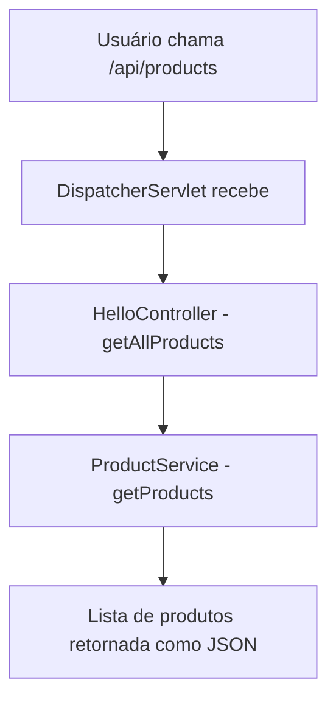

## 📊 Fluxo da Requisição

```mermaid

flowchart TD
    A[Usuário chama /api/products] --> B[DispatcherServlet recebe]
    B --> C[HelloController - getAllProducts]
    C --> D[ProductService - getProducts]
    D --> E[Lista de produtos retornada como JSON]


```
